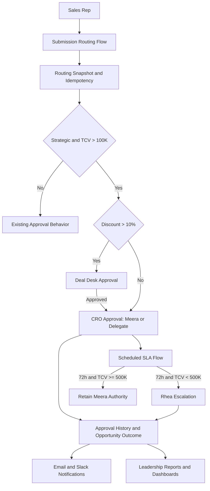

# Implementation Plan: Strategic Account Opportunity Approval Enhancement

## 1. Scope and engineering approach

This scaffold targets Salesforce Sales Cloud using Salesforce DX metadata, native Approval Processes/Flows, Custom Metadata, email templates, Slack Named Credentials, reports, and dashboards. Apex is limited to deterministic routing, snapshot, idempotency, and SLA policy seams that benefit from unit tests; Salesforce Flow remains the orchestration mechanism specified by the TSD.

Native Salesforce approvals remain authoritative for locks, delegated approvers, approval history, and human decisions. Record-triggered Flow prepares and snapshots routing inputs, then invokes the existing Deal Desk process or the CRO process. Scheduled Flow owns reminders and escalation. Custom Metadata owns thresholds and environment-specific user references.

## 2. Component mapping

| TSD component | Scaffold location / implementation seam |
|---|---|
| Opportunity and Account fields | `force-app/main/default/objects/` |
| Submission routing Flow | `force-app/main/default/flows/Strategic_Opportunity_Submission_Routing.flow-meta.xml` |
| Deal Desk handoff | `force-app/main/default/flows/Deal_Desk_to_CRO_Handoff.flow-meta.xml` |
| SLA/reminders | `force-app/main/default/flows/Strategic_CRO_SLA_Monitor.flow-meta.xml` |
| Governed thresholds | `customMetadata/Strategic_Approval_Config.Default.md-meta.xml` |
| Deterministic policy and JSON contract | `classes/StrategicApprovalRouter.cls`, `classes/StrategicApprovalModels.cls` |
| Audit/operations seam | `objects/Strategic_Approval_Execution_Log__c/` |
| Notifications | `email/`, `namedCredentials/`, Flow TODOs |
| Reporting | `reports/`, `dashboards/` |
| Boundary and resilience tests | `classes/*Test.cls` |

## 3. Target tree

```text
force-app/main/default/
├── classes/                         # Apex policy contracts and unit tests
├── customMetadata/                  # Deployable thresholds and policy version
├── dashboards/                      # Monthly and quarterly governance dashboards
├── email/                           # Approval notification templates
├── flows/                            # Declarative orchestration placeholders
├── namedCredentials/                # Slack connection configuration placeholder
├── objects/
│   ├── Account/fields/              # Strategic account field
│   ├── Opportunity/fields/          # Commercial and approval fields
│   └── Strategic_Approval_Execution_Log__c/ # Operational audit log
├── permissionsets/                  # Sales Ops and approval administration access
├── reports/                         # Leadership report placeholders
└── settings/                        # Field history / org settings placeholders
config/                              # Scratch org and deployment configuration
scripts/                             # Deployment and validation command stubs
tests/                               # Apex test coverage is colocated in classes
README.md                            # Setup, deployment, and operations guide
Dockerfile                            # Optional Salesforce CLI container
.env.example                          # Local CLI/environment placeholders
.gitignore                            # Salesforce project ignores
sfdx-project.json                     # Salesforce DX project definition
```

## 4. Build order

1. **Metadata foundation:** create fields, execution log, permission sets, and Custom Metadata; map Meera/Rhea IDs per environment.
2. **Policy seam:** implement and test strict threshold comparisons, routing snapshots, submission-version idempotency, and authority ceiling.
3. **Submission orchestration:** configure the record-triggered Flow and controlled submit action; preserve existing non-CRO behavior.
4. **Approval processes:** configure Deal Desk handoff and CRO approval, including delegated approver and rejection-comment validation.
5. **SLA and notifications:** configure 15-minute Scheduled Flow, 24/48-hour reminders, 72-hour escalation, email templates, Slack Named Credential, retries, and operational logging.
6. **Reporting and access:** publish reports/dashboards, field-level security, history tracking, and runbook.
7. **Validation and release:** full-copy sandbox, historical simulation, boundary/resilience tests, UAT, first-five-production-submission validation, and rollback rehearsal.

## 5. Risks and open questions

- Approval Process metadata and Flow action names are org-specific; an administrator must bind the placeholder Flow metadata to the existing Deal Desk process and actual approval submission actions.
- Salesforce Slack connector capabilities and recipient identity mapping must be confirmed in the target org; Slack failure must remain non-blocking.
- Custom Metadata user references require environment mapping and must never hard-code user IDs.
- The TSD states a seven-year retention requirement; confirm the organization’s archive/export mechanism and legal hold policy.
- Confirm the controlled submit field/action API name and the existing Opportunity approval status field before activation.
- Confirm whether the execution log is a custom object or platform-event-backed implementation at deployment time.

## 6. Quality gates

- All strict boundaries pass: TCV exactly 100,000, discount exactly 10%, and TCV exactly 500,000.
- Duplicate key (`OpportunityId + submissionVersion`) cannot create a second chain.
- Account classification changes after submission do not mutate the stored snapshot.
- Rhea is never actionable for TCV >= 500,000.
- Routing p95, SLA batch, notification retry, lock, and outage tests meet the TSD targets.
- No production activation until Sales Ops, Deal Desk, CRO, and Platform Admin sign off.

## 7. Architecture diagram

Diagram rendering was unavailable in this environment; the valid Mermaid source is retained below.


