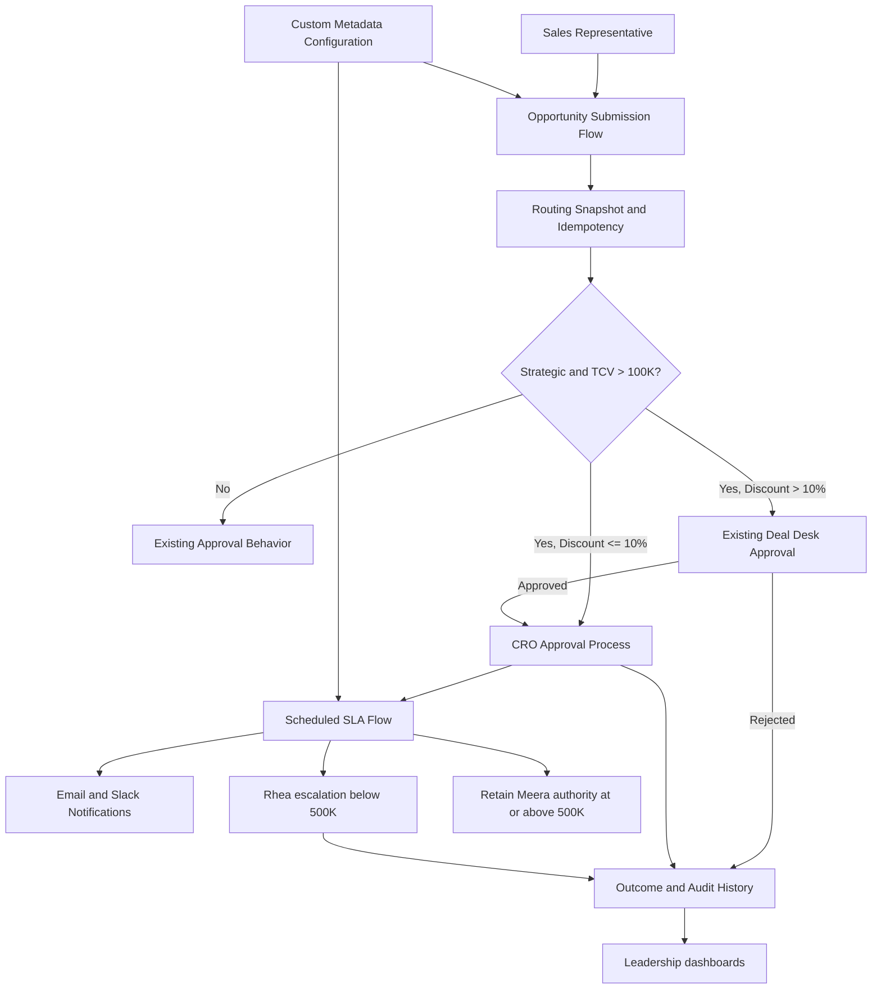

# Implementation Plan: Strategic Account Opportunity Approval Enhancement

## Scope
Scaffold a Salesforce Sales Cloud metadata package for governed CRO approval of Strategic Account Opportunities. The package preserves the existing Deal Desk rule, snapshots routing inputs at submission, supports delegated approval and SLA escalation, and provides notification, audit, operations, and reporting extension points.

## Chosen stack and rationale
- **Platform:** Salesforce Sales Cloud metadata, Flow, Approval Processes, Custom Metadata Types, Reports/Dashboards, and Named Credentials, as mandated by the TSD.
- **Code:** Apex 3-layer support (`api`/invocable entry points -> services -> repositories), used only where Flow/native approval configuration needs deterministic validation, idempotency, logging, or integration seams.
- **Automation:** Record-triggered and scheduled Flow are the system orchestration layer; native Approval Processes remain authoritative for human decisions and standard approval history.
- **Persistence:** Standard Account/Opportunity plus custom fields, `Strategic_Approval_Execution_Log__c`, and `Strategic_Approval_Config__mdt`. No external database is introduced.
- **Notifications:** Salesforce Email Alerts and Slack integration/Named Credential; failures are non-blocking and represented by retry/logging seams.

## Component mapping
| TSD component | Scaffolded artifact |
|---|---|
| Submission routing and snapshot | `StrategicApprovalSubmissionService`, `StrategicApprovalSubmissionInvocable`, Opportunity fields, submission Flow placeholder |
| Existing Deal Desk preservation and handoff | Approval-process metadata placeholder and `DealDeskHandoffService` |
| CRO approval/delegation | Approval-process metadata placeholder, configuration metadata, runbook |
| 24/48/72-hour SLA | Scheduled Flow placeholder, `StrategicApprovalSlaService` |
| Notifications | `NotificationService` interface and Email/Slack adapter seams |
| Audit/operations | `Strategic_Approval_Execution_Log__c` metadata and `ExecutionLogRepository` |
| Reporting | Report/dashboard metadata placeholders and README implementation checklist |
| Security and deployment | Permission sets, custom metadata, package manifest, CI validation stub |

## Target folder structure
```text
force-app/main/default/
├── classes/                         # Apex contracts, orchestration, persistence seams, and tests
│   ├── StrategicApprovalModels.cls  # Typed request/result/config/snapshot DTOs
│   ├── StrategicApprovalModels.cls-meta.xml
│   ├── StrategicApprovalRepository.cls
│   ├── StrategicApprovalRepository.cls-meta.xml
│   ├── StrategicApprovalServices.cls
│   ├── StrategicApprovalServices.cls-meta.xml
│   ├── StrategicApprovalInvocable.cls
│   ├── StrategicApprovalInvocable.cls-meta.xml
│   ├── StrategicApprovalTests.cls
│   └── StrategicApprovalTests.cls-meta.xml
├── objects/Account/fields/           # Strategic account governance field
├── objects/Opportunity/fields/       # TCV, snapshots, approval state, and SLA fields
├── objects/Strategic_Approval_Execution_Log__c/ # Operational audit log object
├── customMetadata/                   # Governed thresholds and feature toggle
├── flows/                            # Submission, handoff, SLA, and notification Flow seams
├── permissionsets/                   # Sales Ops and approval administrator access
├── reports/Strategic_Approval/       # Monthly/quarterly report folder placeholder
├── dashboards/                       # Leadership dashboard placeholder
└── package.xml                        # Deployable metadata manifest
config/
└── project-scratch-def.json           # Salesforce DX scratch-org definition
scripts/
└── validate.sh                        # CI/deployment validation stub
docs/
└── RUNBOOK.md                         # Delegation, operations, rollout, and rollback
force-app/test/                        # Apex test source is colocated in classes
├── testData/                          # Reserved for reusable test data factories
README.md                              # Setup and implementation instructions
Dockerfile                             # Reproducible Salesforce CLI validation container
.env.example                           # Non-secret local variables
.gitignore                             # Salesforce project ignores
```


Mermaid source (retained because renderer was unavailable):


## Build order / milestones
1. **Metadata foundation:** fields, log object, permission sets, custom metadata, package manifest.
2. **Routing contract:** DTOs, repository seams, validation, strict boundary comparisons, submission-version idempotency.
3. **Flow and approval wiring:** controlled submission Flow, Deal Desk after-action handoff, direct/conditional CRO approval, record locking and outcome paths.
4. **SLA and notifications:** scheduled Flow, reminder/escalation rules, authority ceiling guard, Email Alerts, Slack Named Credential and retry logging.
5. **Reporting and security:** snapshot-based reports/dashboards, field-level security, audit history, deployment mapping.
6. **Verification and rollout:** Apex boundary tests, bulk/performance tests, UAT simulation, first-five production validation, feature-toggle rollback.

## Key risks and open questions
- Native Approval Process handoff behavior must be validated in a full-copy sandbox, especially duplicate prevention under retries.
- Exact org API version, existing Deal Desk process name, and existing submission action are deployment-specific and intentionally left as metadata wiring TODOs.
- Salesforce Flow limits and scheduled batch behavior must be measured for 100,000 pending records within 15 minutes.
- Slack recipient lookup and retry mechanics depend on the org's enabled Salesforce Slack package/version.
- Meera/Rhea user references must be environment-mapped through metadata; no user IDs are hard-coded.
- Seven-year retention requires the organization's compliance archive process in addition to Salesforce retention settings.
