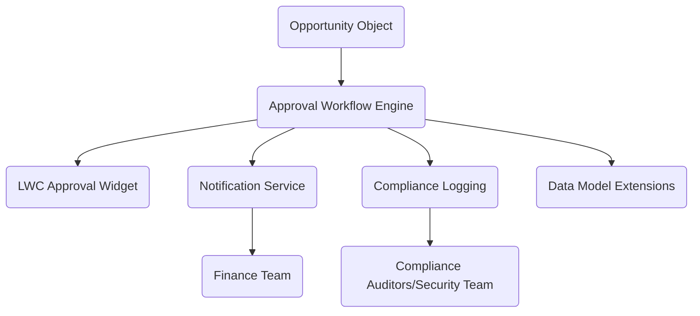

# Technical Specification Document (TSD)

## 1. Overview
The Discount Approval Enhancement project enhances Salesforce Opportunity Management by introducing a second-tier, sequential approval flow for discounts exceeding 25%. The existing approval process for discounts between 10% and 25% is unchanged. This design leverages Salesforce's Apex, Lightning Web Components (LWC), and Flow for orchestration, ensures SLA-driven escalation, and provides auditable, automated notifications to Finance.

**Document Mode:** STANDARD (6 major components: Apex Orchestration, LWC Approval Widgets, Notification Service, Data Model Extensions, SLA Escalation, Compliance Logging)

---

## 2. Context & Background
Existing discount approvals require only one level (Deal Desk, up to 25%). Audit findings and stakeholder feedback indicated the need for executive oversight and automated escalation for higher-value discounts. Enhancements must align with existing Salesforce standard capabilities, require minimal user retraining, and not impact overall platform performance.

---

## 3. Functional Requirements Mapping
| Req ID  | TSD Fulfillment                  |
|---------|----------------------------------|
| BR-01   | Sequential approval for >25%     |
| BR-02   | Deal Desk → VP Sales sequence    |
| BR-03   | Automated Finance notification   |
| BR-04   | SLA: 24h (Deal Desk), 48h (VP)   |
| BR-05   | Auto-escalate to Assistant       |
| BR-06   | Rejection restarts chain         |
| BR-07   | Comments on rejection displayed  |

---

## 4. Architecture

### Core Components:
- **Approval Workflow Engine (Apex/Flow):** Drives sequential approval logic, enforces SLAs, handles rejection, escalation, and logs actions.
- **LWC Approval Widget:** Custom Lightning Web Component for Opportunity record pages; presents approval status, comments, triggers actions.
- **Notification Service:** Uses Salesforce standard email/app events (AppvlWorkItemNtfcnEvent) to notify Finance and escalate SLAs.
- **Data Model Extensions:** Enhanced Opportunity fields (`Second_Tier_Approval_Triggered__c`, `Second_Tier_Approval_Comments__c`), usage of ProcessInstance/Step, new automation triggers.
- **Compliance & Audit Logging:** Centralized logging for all approval/rejection/escalation actions for full traceability.

### Component Collaboration Diagram

Mermaid diagram:

---

## 5. Detailed Design

### Approval Workflow Logic (Apex/Flow)
- Trigger: Opportunity Discount__c > 25%, submission by Deal Owner.
- Step 1: Deal Desk approval (24h SLA enforced; failure handled as per current process).
- Step 2: VP Sales approval (48h SLA; auto-escalation to Executive Assistant if breached).
- Rejection at any tier: Chain restarts from Deal Desk; all rejection comments aggregated and displayed via LWC widget and stored in Opportunity.Second_Tier_Approval_Comments__c.

### Notification Service
- Finance notified (email) whenever second-tier is triggered via AppvlWorkItemNtfcnEvent.
- SLA breach auto-escalation notification to Executive Assistant.
- All notifications logged for audit.

### Data Model Extensions
- Opportunity.Second_Tier_Approval_Triggered__c (Checkbox, set when >25% flow is activated)
- Opportunity.Second_Tier_Approval_Comments__c (Long Text)
- ProcessInstance/Step leveraged for native approval framework compliance.

---

## 6. Technical Decisions & Rationale

- **Apex for workflow orchestration**: Ensures extensibility, granular SLA handling, and robust rejection/escalation logic.
- **LWC for UI widget**: Reusable, performant, Lightning-ready—ensures consistent UX across internal interfaces, mobile/desktop.
- **Utilization of standard Salesforce notification/event model**: Reliability, ease of compliance, and minimal custom code.
- **Audit Logging**: Mandatory for compliance; robust logging of all actions and notifications.
- **Data Model Extension**: Minimal invasive fields; targets auditability and maintainability.

## Alternatives Considered
- **Custom Flow-only approach**: Rejected as Apex is required for robust SLA and escalation, plus audit logging.
- **External process (e.g., Microsoft Power Automate)**: Not preferred—keeps all workflow/process inside Salesforce ecosystem for traceability and maintainability.

---

## 7. Non-Functional Requirements

- **Latency:** Workflow steps must respond within <500ms for actions, notifications within <5s.
- **Availability:** 99.95% uptime (Salesforce platform default).
- **Throughput:** Scalable for up to 5,000 Opportunities/month, each with potential multi-step approvals.
- **Cost:** Native Salesforce components; no incremental license or infra cost.
- **Compliance:** All actions and notifications logged, auditable for 7 years.
- **Security:** Follows Salesforce RBAC, Zero Trust principles. Approval actions restricted by role, notifications to authorized parties only. Comments stored securely.

---

## 8. Implementation Plan & IaC

- **Apex Classes/Triggers:** Implement workflow orchestration, escalation logic, and audit logging.
- **LWC Widget:** Build dynamic approval panel; retrieve and display workflow/approval status, comments.
- **Flow/Process Builder:** Integrate for native process compliance; triggers for notification and SLA timers.
- **Data Model Extension:** Update Opportunity object; deploy new fields as described. Migration step not required as fields are additive.
- **Email Notification Setup:** Configure AppvlWorkItemNtfcnEvent delivery to Finance, VP Sales, Executive Assistant.
- **CI/CD:** Use GitHub Actions for code/package deployment, tests, and release management.

---

## 9. Observability & Monitoring

- **Monitoring:** Leverage Salesforce Monitor, with custom events for rejection, escalation, and notification delivery.
- **Telemetry:** OpenTelemetry can be instrumented (if required by org) for deeper trace/activity; otherwise Salesforce logs are used.
- **Alerting:** SLA breach and failed notification events generate real-time alerts for admins.

---

## 10. Security & Compliance

- RBAC applied on approval actions; only Deal Desk, VP Sales, Executive Assistant can act at respective steps.
- Comments are sanitized and stored in secure Opportunity fields.
- Key Vault (optional) can be used for email templates/config if needed.
- Logs are immutable for audit compliance.

---

## 11. Appendix: Data Model & API References

### Data Model
- Opportunity
  - Discount__c (Decimal)
  - Approval_Status__c (Picklist)
  - Second_Tier_Approval_Triggered__c (Checkbox)
  - Second_Tier_Approval_Comments__c (Long Text Area)
- ProcessInstance, ProcessInstanceStep
- AppvlWorkItemNtfcnEvent (Notification)

### API Endpoints
- Opportunity record updates via Apex trigger
- Notification service via Apex/Flow

---

## 12. Final Compliance Checklist
- SLA enforcement tested for all tiers.
- Second-tier comments aggregated and displayed.
- Finance notification delivered and logged.
- Audit logs generated for all actions.
- Security review completed.
- No impact on existing single-tier approval flow.
