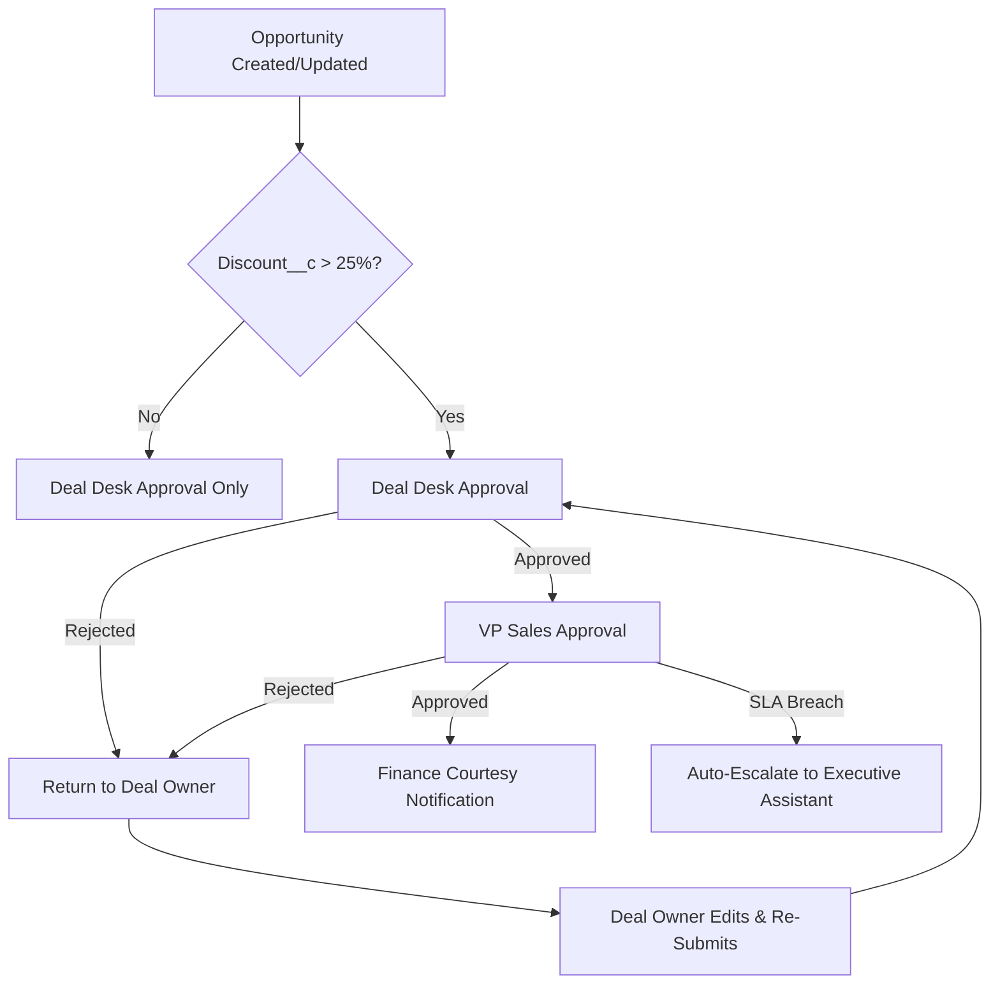

# Technical Specification Document (TSD)

## Project: Discount Approval Enhancement

### Context & Objectives
This TSD defines the architecture for enhancing Salesforce Opportunity Management by introducing a second-tier approval for Opportunity discounts >25%, enforcing sequential approvals (Deal Desk → VP Sales), SLAs, escalation, automated Finance notifications, and full-cycle restart on rejection. The solution leverages Salesforce Apex, Lightning Web Components (LWC), and Flow automation, and is scoped for internal record pages.

**Business Objectives:**
- Improve governance for high-value discounts with a second-tier executive approval
- Maintain existing single-tier approval (10%-25%)
- Provide Finance visibility (compliance/reporting)
- Enforce approval SLAs and escalation
- Ensure full process restart on rejection

**Scope:**
- Trigger second-tier flow for discounts >25%
- Sequential approval workflow (Deal Desk, then VP Sales)
- Automated notification to Finance
- SLA enforcement and escalation
- Rejection triggers restart with combined comments

---

## Functional Architecture

### Approval Flow Logic
- If `Discount__c` ≤10%: No approval required
- If `Discount__c` >10% and ≤25%: Deal Desk approval only (unchanged)
- If `Discount__c` >25%: Sequential approval—Deal Desk → VP Sales
- If VP Sales SLA (48h) breached: auto-escalate to Executive Assistant
- On rejection at any step: process restarts, all comments relayed
- All approval actions/audit events logged
- Finance notified for discounts >25% (FYI)

### System Components
- **Opportunity Approval Orchestrator (Apex/Flow):** Governs stateful workflow, enforces sequencing & SLAs, manages rejection and restart logic
- **Approval UI/Comments (LWC):** Embedded on Opportunity, surfaces approval status/comments to users, bundles rejection messages
- **Notification Engine (Apex):** Triggers email/app notifications to Finance & escalated approvers; leverages `AppvlWorkItemNtfcnEvent`
- **Process Logging/Audit Trail:** Extends Salesforce ProcessInstance and ProcessInstanceStep for audit/compliance
- **Data Enhancements:**
    - `Second_Tier_Approval_Triggered__c` (Opportunity, Checkbox)
    - `Second_Tier_Approval_Comments__c` (Opportunity, Long Text)

### Integration & Automation
- Flows execute on Opportunity record update/submit
- Approval steps tracked via ProcessInstanceStep
- Notification Engine leverages standard Salesforce events
- SLA timer checks (Apex batch/job or Flow)

---

## Data Model & APIs

### Key Salesforce Objects/Fields
- **Opportunity:** `Discount__c`, `Approval_Status__c`, `Second_Tier_Approval_Triggered__c`, `Second_Tier_Approval_Comments__c`, standard/extended fields
- **ProcessInstance**, **ProcessInstanceStep**: workflow steps, status, actors, comments
- **AppvlWorkItemNtfcnEvent:** Notification abstraction for Finance/escalation

### Data Handling
- Comments from Deal Desk and VP Sales are aggregated and stored in `Second_Tier_Approval_Comments__c`
- Audit log persists every approval/rejection step
- Notification status and timing tracked (to verify SLA)

### API/Automation
- Flows (or Apex) on record creation/update
- Async approval triggers, SLA check jobs
- LWC for real-time UI updates

---

## Non-Functional Requirements (NFRs)

| NFR | Target |
|-----|--------|
| SLA enforcement | Deal Desk: 24h, VP Sales: 48h |
| Batch/job latency | <1 minute post SLA breach |
| Notification delivery | <60s from event |
| Approval/rejection audit log availability | Real-time |
| UI responsiveness | <500ms per action |
| Compatibility | Salesforce Lightning (desktop/mobile) |
| System performance | No degradation (Opportunity queries p95 <250ms) |
| Security | RBAC, audit logging, internal only |
| Reliability | 99.95% (same as Salesforce platform) |
| Compliance | Full auditability, exportable logs |

---

## Detailed Workflow Diagram

Below is the sequential approval flow logic as a diagram:

---

## Solution Design & Trade-Offs

- **Extends native Salesforce approval framework:** Faster deployment, leverages existing compliance/audit infrastructure.
- **Apex+Flow for workflow orchestration:** Reliable, maintainable; alternative (all custom Apex) would increase dev/maintenance and risk.
- **LWC for UI:** Flexible display of approval and comments; native Lightning compatibility.
- **Automated notifications:** Uses standard Salesforce event; alternative custom email (less reliable).
- **Batch jobs for SLA enforcement:** Reliable escalation; alternative (manual tracking) not feasible.

**Trade-offs:**
- Using Salesforce native workflow means minimal code, but complexity is managed via orchestration. Custom code only where required for SLAs/comments.
- UI is LWC with custom logic for aggregation of rejection comments (instead of a generic page), improving user readability.

---

## Security & Compliance

- RBAC enforced via Salesforce permissions (Opportunity, ProcessInstance, ProcessInstanceStep)
- Managed identities: Only designated approvers and Finance can access notification data
- Audit log: All actions (approval, rejection, escalation, notification) recorded using ProcessInstance/Step
- Zero Trust: No external surfaces, all operations internal
- Key Vault for system secrets (if Apex integrations)
- Satisfies GDPR, SOX, and standard audit policies via Salesforce logging

---

## Deployment & Operations

- **IaC:** Salesforce metadata (change set) for flows/processes/LWC; version controlled
- **CI/CD:** GitHub Actions, Salesforce DX packages, branch arch-31-09 for new features
- **Monitoring:** Utilize Salesforce built-in audit logs and notification event logs
- **Rollout:** Phased rollout; UAT with VP Sales, Deal Desk, and Finance

---

## Alternatives Considered

- **All Custom Apex Workflow:** More flexibility, but higher maintenance/complexity, less auditability vs. native Flow/Apex
- **Manual SLA enforcement:** Higher risk of missed escalations; batch/automated escalation preferred
- **Custom approval comments page:** More dev, but native LWC is preferred for maintainability

## Final Design Rationale
Chosen architecture leverages native Salesforce workflows and automation, reinforced by custom Apex (for SLA/escalation), with all logic auditable and visible to stakeholders via LWC. This balances speed, auditability, maintainability, and compliance.

---

## Appendix

- Stakeholder meeting notes (BRD reference)
- Salesforce Opportunity Management documentation
- Approval process diagrams
- Example SLA breach handling sequence

---